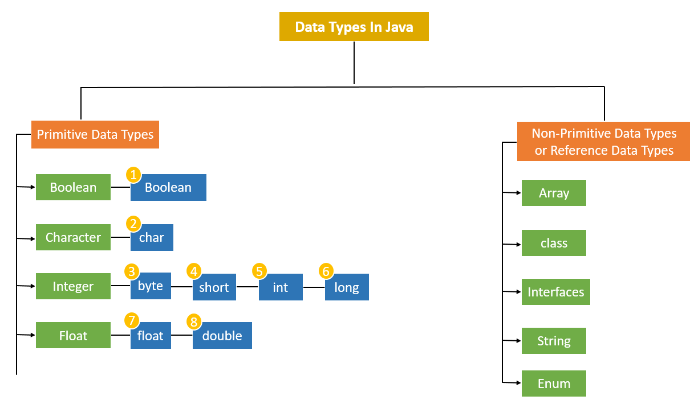

# Java-Data-Types

Java Data Types
1. Primitive Data Types
    a. Integer
    b. Float
    c. Boolean
    d. Character

2. Non-Primitive Data Types
    a. String
    b. Array
    c. Enums
    d. Class
    e. Interface

